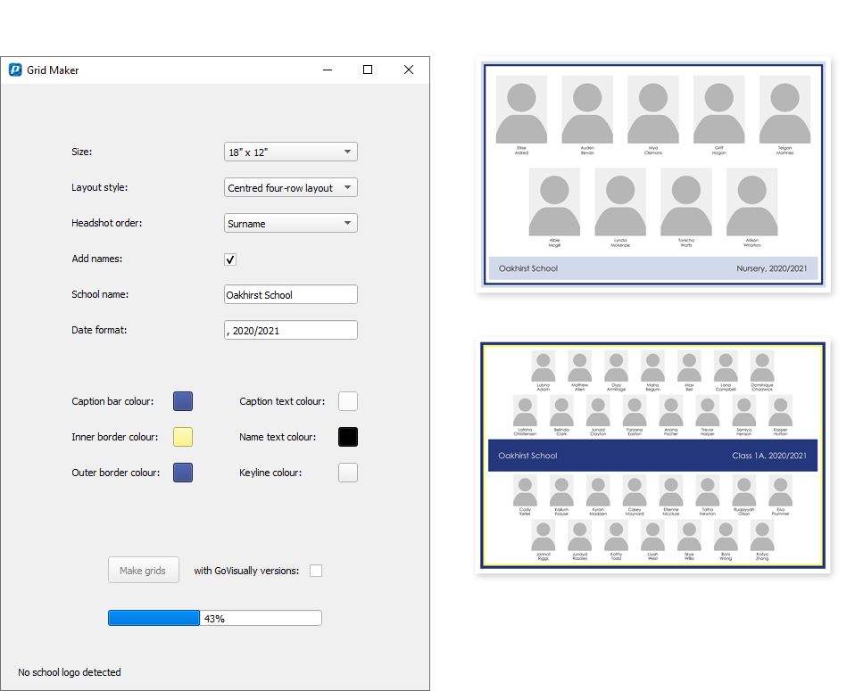

# Grid-Maker

Software which produces headshot grids from a folder of headshot images and a spreadsheet of name and class data.

## Features

- Choice of multiple grid sizes.
- Accepts 2:3 or 3:4 ratio images.
- Two layout styles to choose from.
- Individuals can be placed in any order.
- Teachers are automatically detected and can be put at the top.
- Customisable colours.
- Exports captioned proof versions for upload to proofing website.
- Has a custom mode which allows for grids with any number of people.

## Usage

1. The folder containing the images and the exported sitting list spreadsheet are dragged onto the executable.
2. The images and spreadsheet are checked to ensure each image has a corresponding line on the spreadsheet.
3. A dialogue is presented with the list of classes for which grids can be made. The user can select or deselect them as necessary.
4. Select either Preformatted or Custom size mode.
5. Choose the desired grid settings.
6. Press Make grids.
7. The grids are saved in the original folder.

